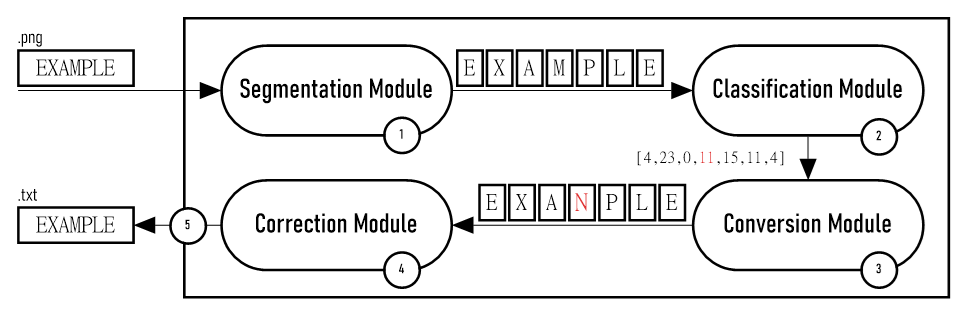
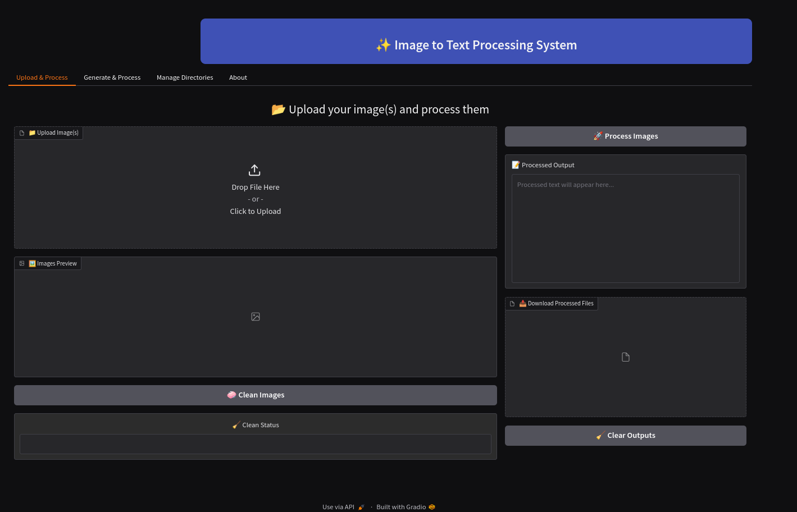
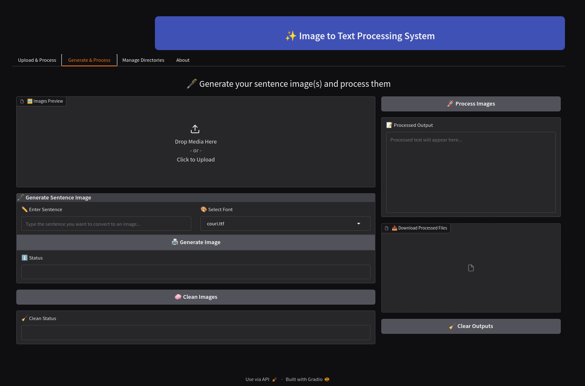
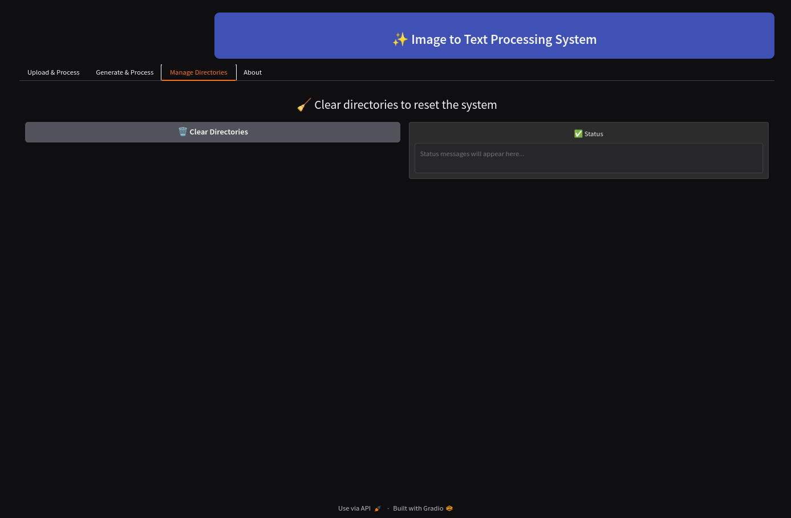
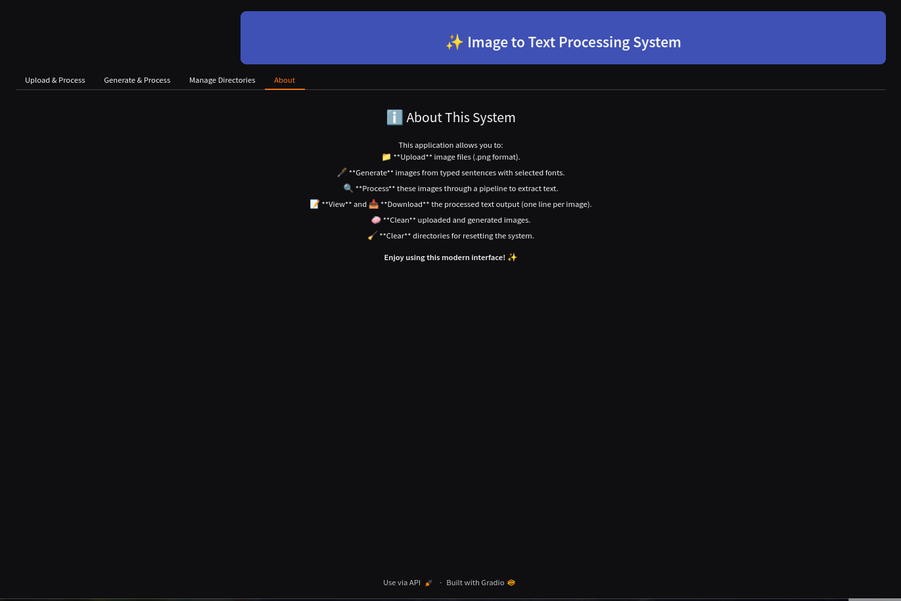

# AlphaNet (Image to Text)

**AlphaNet** is an end-to-end pipeline that takes images containing text and outputs a textual representation of that content. The project is divided into six stages, each responsible for a specific part of the image-to-text process, and orchestrated by a single `main_pipeline.py` script.

---

## Table of Contents
1. [Overview](#overview)
2. [Pipeline Stages](#pipeline-stages)
   - [Stage 1: Sentence Segmentation](#stage-1-character-segmentation)
   - [Stage 2: Character Classification](#stage-2-character-classification)
   - [Stage 3: Vector-to-Text](#stage-3-vector-to-text)
   - [Stage 4: Correction Module](#stage-4-correction-module)
   - [Stage 5: Output Module](#stage-5-output-module)
3. [Installation](#installation)
4. [Usage](#usage)
5. [Roadmap](#roadmap)
6. [System Interfaces and Visual Representation](#system-interfaces-and-visual-representation)
7. [License](#license)

---

## Overview

**AlphaNet** is designed to **convert images into accurate text** by breaking down the recognition task into multiple stages:

1. **Segmenting images into words**
2. **Extracting characters from these words**
3. **Classifying each character**
4. **Converting those classifications into text**
5. **Correcting the recognized text** using a Large Language Model (LLM)
6. **Outputting** the final result

This modular approach makes it easy to replace or improve individual components without affecting the rest of the pipeline. AlphaNet stands out by combining modularity with LLM-powered corrections, ensuring high accuracy in both structured and unstructured text.

---
# Model Workflow Diagram
The following diagram illustrates the workflow of the model:

[](readme_images/model_structure.png)

1. **Segmentation Module**:  
   - Takes a `.png` input, segments the characters in the image, and outputs them sequentially.

2. **Classification Module**:  
   - Processes the segmented characters and generates their corresponding numeric representations (e.g., `[4, 23, 0, 11, 15, 11, 4]`).

3. **Conversion Module**:  
   - Converts the numeric representations into their text equivalent, identifying and marking any errors.

4. **Correction Module**:  
   - Corrects errors in the text (e.g., replacing incorrect characters, as shown with the red **N**).

5. **Output**:  
   - Produces the corrected text, ensuring it matches the expected input.

---
## Pipeline Stages

### Stage 1: Character Segmentation
- **File/Module**: `stage_1`
- **Purpose**: Takes sentence images, breaks them into words, and further segments these into single characters for the next stage.

### Stage 2: Character Classification
- **File/Module**: `stage_2`
- **Purpose**: Classifies each character image (from Stage 1) and maps it to the corresponding textual character.

### Stage 3: Vector-to-Text
- **File/Module**: `stage_3`
- **Purpose**: Converts the classification outputs (which may be in vector/label format) into text strings.

### Stage 4: Correction Module
- **File/Module**: `stage_4`
- **Purpose**: Refines and corrects the recognized text using a Large Language Model (LLM) to ensure higher accuracy and resolve ambiguities.

### Stage 5: Output Module
- **File/Module**: `stage_5`
- **Purpose**: Finalizes the text (e.g., formatting, post-processing) and provides it as output (console, file, or other desired format).

---

## Installation

### Prerequisites
1. Python 3.12 or later.
2. pip (Python package manager).
3. Internet connection for downloading LLM models.

### Steps

1. **Install the following directory**  
   ```bash
   https://msmailarielac.sharepoint.com/:u:/r/sites/AlphaNet/Shared%20Documents/DataSet-Classifciation/DataSet.zip?csf=1&web=1&e=uOYwca
   ```

2. **Clone this repository**:
   ```bash
   git clone https://github.com/your-username/AlphaNet.git
   cd AlphaNet
   git lfs pull #if not already done automatcally
   ```
3. **Create and activate a virtual environment**:
    ```bash
    python -m venv venv
    source venv/bin/activate    # Linux/MacOS  
    venv\Scripts\activate       # Windows
    ```

4. **Install the requerirments**:
   ```bash
   pip install -r requirements.txt
   ```
5. **Install Ollama**
   ```bash
   curl -fsSL https://ollama.com/install.sh | sh #for linux
   ```
   or follow the link and download from [Ollama's website](https://ollama.com/download/windows).

6. **Install LLama2**
   ```bash
   ollama serve&
   ollama pull llama2
   ```
---
# Usage

## Launching the Application

To start the graphical user interface, execute the following command in your terminal:

```bash
python Project_Main/run_gui.py
```

This command will create a server,
in which you can access from your browser using the following url,
```
   http://127.0.0.1:7860
```
Also you can run the pipeline without gui, use the following command:
```bash
python Project_Main/Main_Pipeline.py
``` 
# Image to Text Processing System

## Getting Started

To launch the application, run:

```bash
python Project_Main/run_gui.py
```

# Roadmap📍
- [x] Create an OCR pipeline for converting full sentences to text
- [x] Support panctuation marks
- [ ] Improving Segentation
- [ ] Adjust the pipeline to **IAM Handwritten Forms Dataset**
- [ ] Multi-language Support
  - [ ] Chinese
  - [ ] Spanish

# System Interfaces and Visual Representation

The AlphaNet system incorporates several user interfaces, designed to optimize user experience and operational efficiency. Below is a detailed description of each interface, accompanied by visual representations.

---

## **Upload and Process Interface**
The **Upload and Process Interface** serves as the initial interaction point for users. It supports:
- **Drag-and-Drop Functionality**: Enables seamless image upload without navigating file directories.
- **Real-Time Image Preview**: Provides immediate feedback to verify uploaded content.
- **Instant Image-to-text Options**: In a single button you can run the whole pipeline, and get a visual output.

This interface exemplifies usability by combining simplicity with efficiency.

[](readme_images/image_1.png)

---

## **Generate and Process Interface**
The **Generate and Process Interface** is for text-based image creation and transformation to text. Key features include:
- **Custom Text Generation**: Users can input custom text to generate corresponding images.
- **Font Customization**: A variety of font styles are available to enhance personalization.
- **Integrated Processing**: Generated images can be processed instantly within the interface.
- **Clean Images**: Remove the last uses of the system, for clean and optimal usage.
This component bridges creative input with functional output.

[](readme_images/image_2.png)

---

## **Directory Management Interface**
The **Directory Management Interface** is designed for efficient system maintenance, providing tools to manage operational directories. It includes:
- **Reset Options**: Enables users to restore directories to their default state.
- **Real-Time Feedback**: Displays the current status of directories for enhanced oversight.

This interface ensures smooth backend operation, critical for system stability.

[](readme_images/image_4.png)

---

## **About Section**
The **About Section** offers an overview of the system’s core functionalities in a structured and accessible manner. It highlights:
- **System Capabilities**: Upload, text generation, processing, and directory management tools.
- **Key Features**: Modular design, deep learning integration, and GUI accessibility.

This section functions as a comprehensive introduction to AlphaNet.

[](readme_images/image_3.png)

---

## Conclusion
These visual interfaces exemplify the modular and user-centric design of AlphaNet. Each interface addresses specific stages of the image-to-text conversion pipeline, ensuring both ease of use and operational efficiency. Together, they form an integral part of the system's accessibility and functionality.


# License

This project is licensed under the MIT License. See the [LICENSE](LICENSE) file for details.
